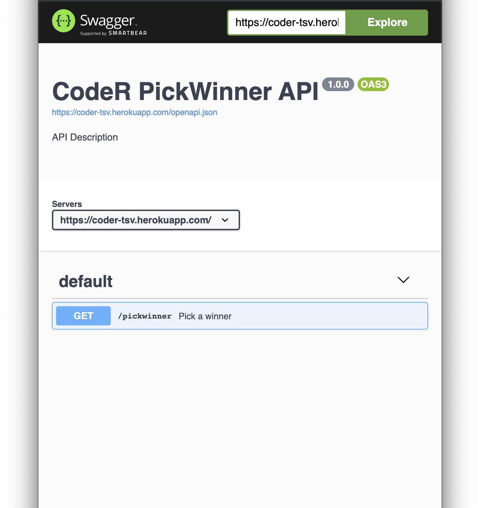

# pickwinner

Example plumber api for picking a winner from a list of items

## Heroku deploy

```
heroku create --buildpack https://github.com/virtualstaticvoid/heroku-buildpack-r.git pickwinner
```
```
heroku git:remote -a pickwinner  # your-heroku-app-name
```
```
heroku stack:set heroku-18
```
```
git push heroku master  # or main
```
```
heroku logs --tail
```
```
curl https://pickwinner.herokuapp.com/pickwinner?l=R,Python
```
# Swagger


